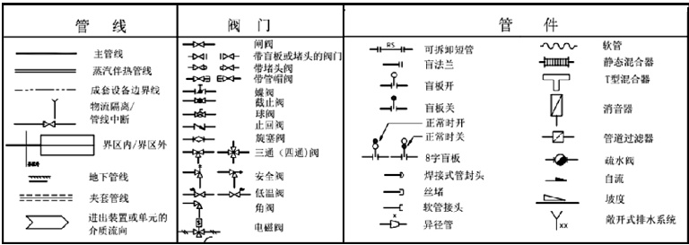
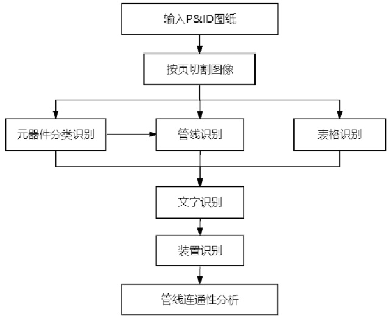
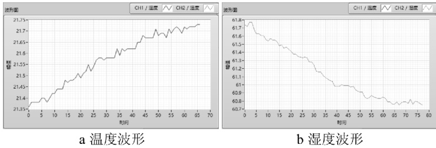
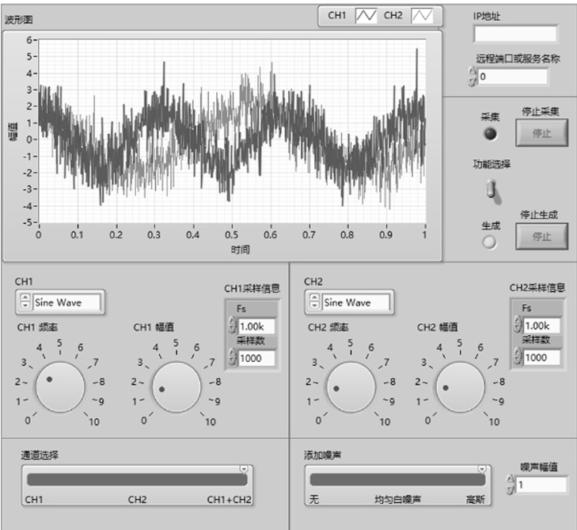

# 基于深度学习的P&ID 图纸智能识别  

陈 彦 王优优 刘 飞 李康杰 张小闻 韩嘉航（石化盈科信息技术有限责任公司，江苏 南京 211100）  

摘要：在石油化工领域，图纸数字化是一种重要的技术趋势。 P&ID 工程图纸是一种常用的工艺流程图，包含了成套设备、管道、自控仪表等大量信息。 探讨了如何构建一套基于人工智能的 P&ID 图纸智能识别方法，通过计算机视觉技术智能识别并提取图纸信息，包括图例符号、文字、线条和表格等，同时可以根据管线连接关系进行关联，以分析管线连通性。 该方法可大幅提高图纸识别和分析效率，实现 P&ID 图纸的数字化转换、存储和管理。  

关键词：P&ID 图纸；工程图纸识别；计算机视觉；卷积神经网络  

Abstract: In the field of petrochemical industry, the digitization of drawings is an important technological trend.P&ID drawings are a kind of commonly used process flow diagrams, which contain a large amount of information about complete sets of equipment, pipelines, automatic control instruments and so on. This paper discusses how to construct a set of artifi鄄 cial intelligence-based intelligent recognition method for P&ID drawings, which intelligently recognizes and extracts drawing information, including legend symbols, text, lines and tables, etc., through computer vision technology, and at the same time, it can be correlated according to pipeline connectivity in order to analyze pipeline connectivity. The method in this paper can greatly improve the efficiency of drawing recognition and analysis, and realize the digital conversion, storage and management of P&ID drawings.  

Keywords: P&ID drawings, engineering drawings recognition, computer vision, convolutional neural netwo  

P&ID 管道和仪表流程图综合反映了工艺流程、设备、管道布置、自控仪表等的设计成果，是企业管理、试运行、操作和开停车维修等各方面所需技术资料的重要部分［1］。 在石化设备管道施工过程中，技术人员需要频繁查阅 P&ID 图纸，因此如何利用数字化技术快速获取信息，是很多石化工程的共同需求。 并且，对存量纸质工程图纸进行矢量化，可以复原老旧的图纸，实现图纸的三维可视化重建，便于长期存储和检索［2］。 为识别 P&ID 图纸，过去通常基于图像处理技术，使用特征提取算法提取图像特征，对特定类型的图形符号进行分类。 近年来，深度学习技术在图像识别领域取得了巨大成功， 许多研究人员开始尝试将其应用于 P&ID 图纸识别［3-6］。 深度学习技术可以通过学习大量的样本数据来自动提取图像中的特征， 并具有良好的分类性能。 然而，现有的方法仍然存在一些问题［7-8］：某些算法功能相对单一，只能识别几种固定的关键元器件，可移植性较差；另一些则可以识别多种元器件，但是准确率相对较低，在处理复杂 P&ID 图纸时往往效果不佳。本文旨在结合实际工程应用场景，构建一套基于人工智能的 P&ID 图纸智能识别方法， 将 P&ID 图纸中的符号、文字、线条和表格定义为需要识别的对象，通过深度学习网络智能识别并提取出图纸中的各类信息， 并根据管线连接关系进行关联。该方法有助于减少大量人工识别和统计整理时间，提高图纸识别分析效率，缩短石化工厂建设工期，实现 P&ID 图纸的数字化转换、存储和管理。  

# 1 整体流程概述  

P&ID 工程图纸包含设备、管线、DCS 仪表、阀门、泵、压缩机、换热器等多种图例符号，如图 1 所示。 仅管道上控制介质流动的阀门就有闸阀、球阀、蝶阀、截止阀、止回阀等数十种不同功能类型的符号，并且根据管线设计情况，部分阀门符号具有不止一种画法。为高效识别图纸中的大量元器件，本文首先构建基于深度残差卷积神经网络的元器件图像分类模型。 通过对来源于真实图纸中的图例符号进行采集和人工标注， 构建了元器件图像数据集。然后将数据集输入神经网络模型进行迭代训练，并通过测试和评估，形成元器件图像分类识别模型供后续使用。  

  
图 1 图例符号示例  

根据图纸中主要装置设备的规模和功能属性， 一份 P&ID工程图纸文件一般包含多页流程图，少则数十页，多则上百页。进行识别处理前，需对原始的图像格式或 PDF 格式的文件进行切割。通常文件前几页为图例符号标识和其他说明内容，应将其剔除之后，再拆分出每一页的图像，逐张处理。 每页图像识别过程包括 5 个部分：首先，通过训练好的元器件图像分类的深度学习模型，识别图纸上的元器件信息，提取每一个元器件所在区域的像素坐标及标注字符。 然后将元器件区域用纯色掩膜图形遮罩，全图遍历提取出有效的水平线和垂直线，识别线条附近的注释内容。根据水平线和垂直线搜索查找所有线路之间的关系，由此确定每个管道线路的全程位置信息。同时，识别出图纸外边缘的框线和标题栏等表格区域，提取出施工项目、装置名称等辅助信息。 最后综合多种已知信息，识别出图纸上的主体装置，关联各类元器件及管道，完成 P&ID 图纸信息数字化转换。 上述图纸识别流程如图 2 所示。  

# 2 模型训练  

近年来，深度学习方法在图像分类任务中展现出卓越的性能，并且能够适应于训练数据规模较小和计算能力有限的情况［9-10］。本文采用了基于深度残差卷积神经网络构建的目标检测模型，对图纸上的元器件进行分类识别的效果明显， 与传统图像学方法相比较，有较高的准确性和鲁棒性，同时具有较快的推理速度和较低的计算资源消耗，更适用于元器件的分类识别任务。  

元器件图像分类模型以轻量级网络（Darknet-53）作为其基础网络，网络结构由多个卷积层、残差层和全连接层组成，基于特征金字塔结构，多尺度融合不同层的信息。 在输入端通过缩放、色彩空间调整等方式进行数据增强，并通过裁剪、旋转的方式进行拼接，丰富待检测目标的图像背景，增强网络特征提取能力，提高检测准确性。 模型训练流程如图 3 所示。 本文收集了 450 张某石化工程设计院的真实图纸， 首先从图例页中剪裁出特定的符号，建立符号图形库。 然后对图纸进行数据清洗、重命名、去重，使用 LabelImg 软件手动标注图形的边界框， 以确定每个符号的关键像素点信息。 将标注完的数据按照 8:2 的比例随机划分为训练集和测试集，输入模型进行训练。 随着训练的进行，损失函数均值持续下降，模型逐渐优化并收敛于最优解。 当训练轮数达到 300时，损失值基本保持在 0.005。最终构建完成的模型网络架构具有367 层，总参数量为 46 587 543，识别准确度达到 $90.4\%$ ，召回率达到 $82.1\%$ ，能够支持 86 种元器件识别。  

  
图 2 P&ID 图纸智能识别流程  

  
图 3 元器件图像分类模型训练流程  

# 3 图像预处理  

图像预处理有助于排除或降低 P&ID 图纸中的干扰元素，并去除多余信息，从而简化下一步的图元识别和检测工作。本文对图像预处理时利用了图像分割、 二值化和平滑去噪等图形学技术。 原 PDF 中提取的图像分辨率较高，单次处理比较慢，对机器要求高。 因此通过滑动窗口分割的方式，以 $640\times640$ 像素的窗口为主体，从左向右，由上往下，逐步分割图像，全部碎片化后再进行下一步处理，从而提升处理速度。图像二值化旨在将彩色图像转化为黑白两类像素矩阵的形式，降低图像的信息量。需要依据全图像素平均值设定一个灰度阈值， 当像素点的灰度大于该阈值时，设置这个点为黑，反之为白。 平滑去噪为采用中值滤波的方法，通过 $3{\times}3$ 的中值滤波窗口，取 9 个点的像素值中值作为中心点变化之后的像素值， 以降低或消除图像上噪音像素的干扰，同时不破坏原图像的轮廓。  

# 4 分类识别  

# 4.1 元器件识别  

为了应用利用之前训练得到的元器件图像分类模型来检测图纸，首先应用滑动窗口技术，以小步幅在整张图纸上滑动，若窗口内 $90\%$ 以上像素点为白色，可认为该区域不存在需识别的内容，可以将其过滤舍弃。黑色像素密集的窗口则通过神经网络进行处理，输出该区域属于各元器件类型的预测概率，使用预定义的每一类的置信度阈值，对预测概率进行阈值处理，将概率转换为离散的分类结果。 同时，对于多个重叠窗口中的识别结果，利用非极大值抑制 NMS 算法清理冗余的边界框，解析出局部极大值的最优解，得到单个元器件符号目标。最后将识别到的每个元器件以结构化数据的形式记录其符号类别、图像高度和宽度、边界左上点坐标 $(x1,y1)$ 和右下点坐标 $(x2,y2)$ 等信息。  

# 4.2 管线识别  

一般来说，在 P&ID 工程图纸中，大量的线路是以水平线或垂直线的形式表示，且连续实线代表管线，虚线代表电信号线。检测管线的步骤如下。 首先，为了避免元器件轮廓线的干扰，对已识别出元器件的区域进行形态学的闭运算， 填补符号内部的空隙，再将其像素点压缩腐蚀，去除图像噪音，确保提升后续管道线路检测的精度。对处理后的图像进行从左到右，从上到下的遍历，确定最常用的线条粗细，并将所有线条粗细压缩到一个像素。然后，识别出图纸中黑色像素相连的区域，也就是管线，记录像素数在长度和高度上的分布，提取线条对象的坐标和长度。最后，将分离出来的线条根据最常使用的线条粗细进行融合。  

# 4.3 表格识别  

分析 P&ID 图纸的版面布局可知， 右下角一般为图纸标题栏，以表格形式记录了该页图纸的施工信息。同时图纸上下边缘和右侧也常有备注栏，包含有装置、管线、物料等属性信息。此类内容均属于读图时需要重点关注的表格。识别表格的步骤为：选择图纸上最长的水平线，搜索图上与该线相连的所有黑色像素，识别出与之连接的线条，这样即可得到外边框线。然后对提取的黑色像素进行形态学处理，识别出外边界和标题框的区域，将之去除，获取图纸中心区域最大轮廓的坐标信息。据此对原图像进行掩膜遮罩处理，反过来去除中心区域，保留边缘区域。 最后求解垂直线与水平线的焦点，按照焦点位置切割图像，分别获取图中所有的表格。  

# 4.4 字符识别  

文本内容是 P&ID 图中的关键元素， 不仅用于工艺流程说明，还用于标识和描述图纸上的各类图形，例如元器件符号中的注释可用于从时间序列传感器数据库中获取标签数据， 管线附近的注释则用于指定管道的编号、长度和直径。 对于元器件符号和管线周围的文字，直接使用光学字符识别（OCR）技术进行识别。 而表格中的文本则首先利用 PP-Structure 文档分析模型［11］，检测表格的结构布局，拆分和裁剪出表格中的每个单元格，再使用OCR 对每个分割后的区域进行字符检测。文字识别结果导出至数据库保存，还需要与图纸中的装置管线进行匹配，作为其补充语义信息，综合各环节的检测结果才能形成完整的数字化文件。  

# 4.5 装置识别  

P&ID 图纸的中心区域通常为化工装置主体，每个装置形态各不相同，且数量较少。 本文采取的措施是从 OCR 识别内容中检索图纸备注栏中的装置名称， 再在中心区域确定装置名称的坐标，确定主体装置的位置。 并向四周搜索连续相连的像素点，得到装置的轮廓，在数据库内记录其坐标。  

# 5 结束语  

经由上述步骤建立的 P&ID 图纸数据库，包含元器件、管线和装置等实体的类别和坐标信息， 并相互关联， 可通过装置编号、管线编号等不同形式进行搜索，为后续的工程设计和施工提供重要的参考依据。 据此实现了管线的连通性分析，步骤为：首  

（下转第 17 页）  

# 5.2 实验效果  

利用温湿度数据采集实验进行验证［5］。 将温湿度传感器连接到实验箱，以采集的室内温湿度作为实验数据。 测试过程中，以实验箱作为服务器端，该系统输入指定的 IP 地址和端口号。 作为客户端与服务器端连接，传感器持续采集数据，通过 TCP/IP 实现远程无线传输， 系统实时读取到传输数据并以波形形式直观展现在系统前面板，温湿度数据波形如图 2 所示，图中波形图横坐标表示采集的时间长度，单位为秒（s），纵坐标表示采集到的信号幅值。 从图中可以看到，实验时室内温度基本保持在 $21^{\circ}\mathrm{C}$ ，湿度基本保持在 $61\%$ rh。 实验数据也可以 Excel 文件形式存储在本地，与波形图显示情况一致。  

  
图 2 数据波形  

针对系统的虚拟信号发生器功能， 本文用两个通道的信号进行测试。 CH1 选择正弦波信号，频率设置为 1.5，幅值设置为2；CH2 选择三角波信号，频率设置为 2，幅值设置为 2。 两个信号的采样率、采样数均设置为 $1.00~\mathsf{k H z}$ 和 1000，选择双通道示波，并叠加幅值为 1 的高斯噪声，测试效果如图 3 所示，图中波形图横坐标表示 1 个单位时间，纵坐标表示信号幅值。  

# 6 结束语  

本文提出的远程实验监测系统， 操作简便， 功能可不断扩展，可低成本解决线上实验课教学的难点，提高线上实验课教学的效率和效果，有助于节约教学资源，可推广到技能人才培训以及一校多校区同步做同一个实验的场景。  

  
图 3 虚拟信号发生器  

# 参考文献  

［1］袁乙平，罗鸣，胡玥玥，等.后疫情时代高校大学化学实验教学模式探索［J］.化工管理，2022（25）：37-41  
［2］刘沁，邱顺佐，张维，等.基于单片机控制的远程报警温控系统设计［J］.工业控制计算机，2023，36（2）：127-129  
［3］张新鑫，张文杰，李响，等.基于无线的实验数据监控系统设计与开发［J］.自动化技术与应用，2021，40（1）：129-132，145  
［4］姚娟，张志杰，李丽芳.基于 LabVIEW 和 TCP 的数据采集系统设计与实现［J］.电子技术应用，2012，38（7）：72-74  
［5］焦键.基于 LabVIEW 和单片机的温度监测系统设计［J］.工业控制计算机，2022，35（6）：135-136，147  

［收稿日期：2023－08－17］  

# 333333333333333333333333333333333333333333333333  

（上接第 14 页）  

先抽取数据库中所有管线的像素点坐标，采用 k-均值聚类算法对坐标进行聚类分析，快速判断出每张图纸中管线的主要走向。进一步地抽取管件连接方式和管线编号等语义信息， 结合管线走向，可方便地确定出特定装置设备的物料流动路径，获取多张图纸之间的管线连通性关系，大幅提高读图效率。  

本文方法可以在图纸再造、 工艺追踪和工艺操作优化等方面发挥重要作用，推动数字孪生工厂的建设与运维，为设计工程师和工艺技术员提供有力支持。  

# 参考文献  

［1］PALIWAL S, JAIN A, SHARMA M, et al. Digitize-PID: Auto鄄matic Digitization of Piping and Instrumentation Diagrams[C]//Trends and Applications in Knowledge Discovery and DataMining( PAKDD 2021), 2021: 168-180  
［2］范帆，关佶红.工程图纸字符串及标注信息提取［J］.计算机工程与应用，2012，48（7）：161-164  
［3］MANI S, HADDAD M A, CONSTANTINI D, et al. AutomaticDigitization of Engineering Diagrams using Deep Learningand Graph Search[C]// 2020 IEEE/CVF Conference on Comput鄄er Vision and Pattern Recognition Workshops (CVPRW) ,2020: 673-679  
［4］EUN-SEOP YU, JAE-MIN CHA, TAEKYONG LEE, et al. Fea鄄tures Recognition from Piping and Instrumentation Diagramsin Image Format Using a Deep Learning Network[J]. Energies,2019, 12(23): 4425  
［5］ELYAN E, JAMIESON L, ALI-GOMBE A. Deep learning forsymbols detection and classification in engineering drawings[J]. Neural Networks, 2020, 129: 91-102  
［6］ELYAN E, MORENO-GARC魱A C F, JOHNSTON P. Symbolsin Engineering Drawings (SiED): An Imbalanced Dataset Bench鄄marked by Convolutional Neural Networks[C]// Proceedings ofthe 21st Engineering Applications of Neural Networks Confer鄄ence, 2020: 215-224  
［7］宋小鸿.工程图纸的关键信息智能提取技术［D］.北京：北京交通大学，2019  
［8］王恩日.基于图像识别的工程图仪表标注研究［D］.上海：上海交通大学，2019  
［9］刘立，陈玉辉，刘晓婷.一种工程图纸类文档识别分类的技术研究［J］.电子设计工程，2020，28（12）：89-94  
［10］徐剑，张皓，徐航，等.一种基于 Faster RCNN 的电网图元识别方法［J］.计算机与现代化，2021（12）：53-57  
［11］CHENXIA LI, RUOYU GUO, JUN ZHOU, et al. PP -Struc鄄tureV2: A Stronger Document Analysis System[J]. arXiv preprintarXiv: 2210.05391, 2022  

［收稿日期：2023－08－29］  