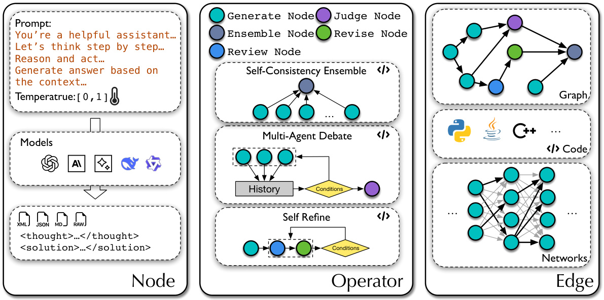
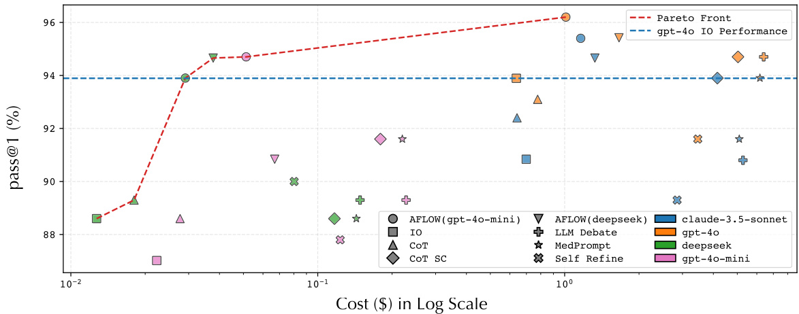

# AFLOW: AUTOMATING AGENTIC WORKFLOW GENERATION  

Jiayi Zhang1,2∗, Jinyu Xiang1,∗Zhaoyang $\mathbf{Yu^{3}}$ , Fengwei $\mathbf{Teng^{3}}$ , Xionghui Chen4, Jiaqi Chen5, Mingchen Zhuge6, Xin Cheng3, Sirui $\mathbf{Hong^{1}}$ , Jinlin Wang1, Bingnan Zheng5, Bang Liu7, Yuyu Luo2,8,† Chenglin $\mathbf{W_{u}}^{1}$ †  

1DeepWisdom, 2The Hong Kong University of Science and Technology (Guangzhou)   
3Renmin University of China 4Nanjing University 5Fudan University   
6King Abdullah University of Science and Technology, 7Universite´ de Montre´al & Mila   
8The Hong Kong University of Science and Technology  

# ABSTRACT  

Large language models (LLMs) have demonstrated remarkable potential in solving complex tasks across diverse domains, typically by employing agentic workflows that follow detailed instructions and operational sequences. However, constructing these workflows requires significant human effort, limiting scalability and generalizability. Recent research has sought to automate the generation and optimization of these workflows, but existing methods still rely on initial manual setup and fall short of achieving fully automated and effective workflow generation. To address this challenge, we reformulate workflow optimization as a search problem over code-represented workflows, where LLM-invoking nodes are connected by edges. We introduce AFLOW, an automated framework that efficiently explores this space using Monte Carlo Tree Search, iteratively refining workflows through code modification, tree-structured experience, and execution feedback. Empirical evaluations across six benchmark datasets demonstrate AFLOW’s efficacy, yielding a $5.7\%$ average improvement over state-of-the-art baselines. Furthermore, AFLOW enables smaller models to outperform GPT-4o on specific tasks at $4.55\%$ of its inference cost in dollars. The code will be available at https://github.com/geekan/MetaGPT.  

# 1 INTRODUCTION  

Large Language Models (LLMs) have emerged as powerful tools for solving complex tasks across various domains, including code generation, data analysis, decision-making, and question answering (Liu et al., 2024; Li et al., 2024a; Zhu et al., 2024; Xie et al., 2024b; Sun et al., 2024; Wang et al., 2024b; Song et al., 2023; Xie et al., 2024a; Zhong et al., 2024a). However, the rapid advancement of LLMs heavily relies on manually designed agentic workflows – structured sequences of LLM invocations accompanied by detailed instructions. Designing and refining these workflows requires significant human effort, which limits the scalability and adaptability of LLMs to new, complex domains and hinders their ability to transfer skills across diverse tasks (Tang et al., 2024).  

Recent efforts have focused on automating the discovery of effective agentic workflows to reduce the reliance on human intervention (Khattab et al., 2024; Yu¨ksekgo¨nu¨l et al., 2024; Liu et al., 2023; Hu et al., 2024). Despite these advancements, full automation has not been achieved. For instance, Khattab et al. (2024) requires manual workflow setup before automated prompt optimization. Similarly, methods proposed by Yu¨ksekgo¨nu¨l et al. (2024) and Zhuge et al. (2024) fail to capture the full diversity of workflows necessary for a wide range of tasks (Yu et al., 2023; Yang et al., 2024b; Sun et al., 2023), as their optimization objectives struggle to represent the breadth of possible workflows. The inability to effectively model diverse workflow structures within these automated systems limits their utility and impact. ADAS (Hu et al., 2024) represents workflows using code, achieving a relatively complete representation. However, due to the efficiency limitations of its linear heuristic search algorithm, ADAS struggles to generate effective workflows within a limited number of iterations. This highlights the need for more effective techniques to represent and automate the generation of agentic workflows, which would accelerate the application of LLMs across domains.  

  
Figure 1: Performance comparison with other methods. To assess the method’s performance, we employ various metrics across different datasets: solve rate for Math and GSM8K, F1 score for HotpotQA and DROP, and pass $\ @1$ for HumanEval and MBPP. Our AFLOW (highlighted in yellow) consistently outperforms all automated workflow optimization and manually designed methods across all six benchmarks.  

In response to these challenges, we introduce an innovative framework for automatically generating agentic workflows. Our key idea is to model the workflow as a sequence of interconnected LLM-invoking nodes, where each node represents an LLM action and the edges define the logic, dependencies, and flow between these actions. This structure transforms the workflow into a vast search space, encompassing a wide variety of potential configurations. Our goal is to efficiently navigate this space, automatically generating optimized workflows that maximize task performance while minimizing human intervention.  

However, the diversity and complexity of tasks present significant challenges. Specifically, each task can have different requirements, operations, and dependencies, which makes it difficult to represent them in a unified yet flexible manner (Chen et al., 2021; Cobbe et al., 2021; Yang et al., 2018; Luo et al., 2018). Furthermore, the search space for possible workflows, comprising an immense number of code structures and node configurations, is virtually boundless, creating an additional challenge for efficient exploration and optimization.  

To address these challenges, we propose AFLOW, a Monte Carlo Tree Search (MCTS)-based framework designed to systematically explore and discover optimal agentic workflows. AFLOW represents workflows as flexible nodes connected by code-based edges, which encapsulate possible relationships such as logical flows, conditions, and dependencies. These edges allow the workflow to be modeled as a graph (Zhuge et al., 2024) or network (Liu et al., 2023), offering a powerful structure for capturing complex interactions between LLM invocations.  

To enhance the search process and improve efficiency, AFLOW introduces a novel concept of operators – predefined, reusable combinations of nodes representing common agentic operations (e.g., Ensemble, Review & Revise). These operators serve as foundational building blocks for constructing workflows and are integrated into the search space, ensuring that the exploration process leverages known patterns of effective agentic operations.  

AFLOW employs the MCTS algorithm to navigate this infinite search space. The framework’s workflow optimization process incorporates several key innovations: a soft mixed-probability selection mechanism for node exploration, LLM-driven node expansion to introduce new possibilities, execution evaluation to assess workflow performance, and backpropagation of experience to refine future search iterations. This combination of techniques ensures that AFLOW efficiently discovers workflows that adapt to the complexity of diverse tasks while reducing reliance on manual intervention.  

We make the following key contributions:  

• Problem Formulation: We formalize the workflow optimization problem, generalizing prior approaches as specific cases. This provides a unified framework for future research at both the node and workflow optimization levels.   
• AFLOW: We introduce AFLOW, an MCTS-based method that automatically discovers effective workflows across multiple domains with minimal human intervention.   
• Extensive Evaluation: We evaluate AFLOW on six benchmark datasets: HumanEval, MBPP, MATH, GSM8K, HotPotQA, and DROP. AFLOW outperforms manually designed methods by $5.7\%$ and surpasses existing automated approaches by $19.5\%$ . Notably, workflows generated by AFLOW enable smaller LLMs to outperform larger models, offering better cost-performance efficiency, with significant implications for real-world applications.  

# 2 RELATED WORK  

Agentic Workflow. Agentic workflow and autonomous agents (Zhuge et al., 2023; Hong et al., 2024a; Zhang et al., 2024; Wang et al., 2023) represent two distinct paradigms of LLM application. The former completes tasks statically through predefined processes with multiple LLM invocations, while the latter solves problems dynamically through flexible autonomous decision-making. Compared to autonomous agents that require specific actions and decision patterns designed for the environment, agentic workflows can be constructed based on existing human domain experience and iterative refinement, offering higher potential for automated construction.  

Agentic workflows can be broadly categorized into general and domain-specific types. General workflows emphasize universal problem-solving approaches, such as (Wei et al., 2022; Wang et al., 2022; Madaan et al., 2023; Wang et al., 2024a). Domain-specific workflows focus on building effective processes to solve domain-specific problems, such as code generation (Hong et al., 2024b; Ridnik et al., 2024; Zhong et al., 2024a), data analysis (Xie et al., 2024b; Ye et al., 2024; Li et al., 2024a; Zhou et al., 2023), mathematics (Zhong et al., 2024b; Xu et al., 2024), question answering (Nori et al., 2023; Zhou et al., 2024a). Existing work has manually discovered numerous effective agentic workflows, but it’s challenging to exhaust various tasks across different domains, further highlighting the importance of automated workflow generation and optimization.  

Automated Agentic Optimization. Recent work aims to automate the design of agentic workflows, categorized into three types: automated prompt optimization, hyperparameter optimization, and automated workflow optimization. Prompt optimization (Fernando et al., 2024; Yu¨ksekgo¨nu¨l et al., 2024; Yang et al., 2024a; Khattab et al., 2024) uses LLMs to optimize prompts within fixed workflows. Hyperparameter optimization (Saad-Falcon et al., 2024) focuses on optimizing predefined parameters. While these approaches improve performance, they are limited in generalization to new tasks and often require moderate human effort for task-specific designs.  

Automated workflow optimization (Li et al., 2024b; Zhou et al., 2024b; Zhuge et al., 2024; Hu et al., 2024) aims to optimize entire workflow structures, offering more potential for fully automated generation. Recent works explore diverse representations and methods. GPTSwarm (Zhuge et al., 2024) uses graph structures with reinforcement learning, but struggles to represent workflows with conditional states due to graph structure limitations. ADAS (Hu et al., 2024) utilizes code structures to represent workflows and stores historical workflows in a linear list structure, aligning closely with our goals. However, it is constrained by the efficiency of its search algorithm as it relies on overly simplistic representations of experiences in the searching process, making it challenging to discover effective workflows.  

AFLOW also uses code to represent workflows, but goes further by providing a more fundamental structure called named node. This structure encompasses various LLM invocation parameters, allowing for more detailed workflow representation. We also introduce operators that implement predefined node combination functions. Simultaneously, AFLOW employs a specially designed MCTS algorithm for automated workflow optimization, leveraging the tree-structured experience and execution feedback to efficiently discover effective workflows.  

# 3 PRELIMINARY  

In this section, we will first formulate the automated agentic workflows generation problem in Section 3.1 and then discuss design considerations of our AFLOW in Section 3.2. For the core concept of this section, we provide an example explanation in Figure 2.  

  
Figure 2: The example of node, operator, and edge. We demonstrate the optional parameters for Nodes, the structure of some Operators, and common representations of Edges.  

# 3.1 PROBLEM FORMULATION  

Agentic Workflow. We define an agentic workflow $W$ as a sequence of LLM-invoking nodes, denoted as $\mathcal{N}=\{N_{1},N_{2},...,N_{i}...\}$ . Each node $N_{i}$ represents a specific operation performed by an LLM and is characterized by the following parameters. The code abstraction of the node is shown in Appendix A.2.  

• Model $M$ : The specific language model invoked at node $N_{i}$ .   
• Prompt $P$ : The input or task description provided to the model at each node.   
• Temperature $\tau$ : A parameter controlling the randomness of the LLM’s output at node $N_{i}$ .   
• Output format $F$ : The format in which the model’s output is structured (e.g., xml, json, markdown, raw). The node in workflow should provide different output formats, inspired by the Tam et al. (2024).  

These nodes are connected by edges $E$ , which represent the connection between the nodes, governing the sequence of execution. The edges $E$ can represent various structures, such as:  

• Graph Zhuge et al. (2024): A flexible structure representing hierarchical, sequential, or parallel relationships between nodes, allowing for complex branching workflows.   
• Neural Network (Liu et al., 2023): A structure that can represent complex, non-linear relationships between nodes, allowing for adaptive and learnable workflows based on input and feedback.   
• Code (Hu et al., 2024): A comprehensive representation that can express linear sequences, conditional logic, loops, and incorporate graph or network structures, offering the most precise control over workflow execution.  

Automated Workflow Optimization. Given a task $T$ and an evaluation function $G$ , the goal of workflow optimization is to discover a workflow $W$ that maximizes $G(W,T)$ . This can be formulated as a search process where an algorithm $A$ explores the search space $s$ to determine the optimal workflow configuration. The search space $s$ for a workflow optimization problem encompasses all possible configurations of node parameters and edge structures:  

$$
{\mathcal{S}}=\{({\mathcal{N}},E)\mid E\in{\mathcal{E}}\},
$$  

where $\mathcal{N}=\{N(M,\tau,P,F)\mid M\in\mathcal{M},\tau\in[0,1],P\in\mathcal{P},F\in\mathcal{F}\}.$ , with $\mathcal{M},\mathcal{P},\mathcal{F},\mathcal{E}$ representing the sets of possible language models, prompts, output formats, and edge configurations, respectively.  

  
Figure 3: Overall AFLOW framework: By setting a search space composed of nodes with only prompt parameters flexible, a given operator set, and a code representing edge, AFLOW performs an MCTS-based search within this space. Through a variant of MCTS designed for workflow optimization, AFLOW iteratively executes a cycle of Soft Mixed Probability Selection, LLM-Based Expansion, Execution Evaluation, and Experience Backpropagation until reaching the maximum number of iterations or meeting convergence criteria.  

With this formulation, the workflow optimization problem can be expressed as:  

$$
\begin{array}{l}{{W=A({\cal S},{\cal G},{\cal T}),}}\\ {{W^{\ast}=\underset{W\in{\cal S}}{\arg\operatorname*{max}}{\cal G}(W,{\cal T}),}}\end{array}
$$  

where $A$ is the search algorithm that explores the search space $s$ , and $W^{*}$ is the optimal workflow configuration that maximizes the evaluation function $G$ for the given task $T$ .  

# 3.2 AFLOW OVERVIEW  

Limitations of Previous Methods. Previous approaches Yu¨ksekgo¨nu¨l et al. (2024); Khattab et al. (2024); Zhuge et al. (2024) to workflow optimization have primarily been constrained by the limited scope of their search spaces, based on problem definition in Section 3.1. Another related work, ADAS (Hu et al., 2024), searches in a larger space comprising a combination of prompts $N(P,T)$ and edges $E$ , but fails to discover effective workflows due to the efficiency limitations of its linear heuristic search algorithm.  

Formulation. To address the limitations of previous methods, we propose AFLOW, a novel framework that leverages Large Language Models (LLMs) as optimizers within a variant of Monte Carlo Tree Search (MCTS) to search for optimal workflows. By representing nodes $N$ and edges $E$ through code, AFLOW can explore the full range of possible agentic workflows, ensuring completeness in the search space. Specifically, as shown in Figure 3, AFLOW uses a variant of MCTS to iteratively explore the workflow search space, evaluate different configurations, and backpropagate experiences to refine the workflow optimization process.  

To enhance search efficiency in practice, we simplify the search space by fixing key parameters such as the model $M$ , temperature $\tau$ , and format $F$ . This simplification allows AFLOW to focus its search primarily on the code-represented edges $E$ and prompts. To navigate this still vast search space effectively, we introduce the concept of Operators. These Operators encapsulate common agentic operations (e.g., Ensemble, Review, Revise) by combining $N$ and $E$ into unified interfaces, thereby enabling more efficient utilization by AFLOW. By employing these Operators, we achieve more efficient search and streamlined workflow generation.  

<html><body><table><tr><td colspan="2">Algorithm 1 Algorithm of AFLow.</td></tr><tr><td colspan="2">Require: Initial Workfow Wo, Evaluator G, Dataset D, Operators O, Max iterations Nmaz Ensure: Optimized Workflow W* 1: Initialize Wo, split D into Dv and DT</td></tr><tr><td colspan="2">2: W* ← Wo</td></tr><tr><td>3: for iteration ← 1 to Nmax do</td><td></td></tr><tr><td>4: workflow ← Select(tree)</td><td> Using soft mixed probability strategy</td></tr><tr><td>5: child.work flow ← Expand(workflow, O)</td><td> LLM-based expansion</td></tr><tr><td>6:</td><td> Multiple runs for robustness</td></tr><tr><td>7:</td><td>score ← Evaluate(child.work flow, G, Dv) Backpropagate(child.work flow, score)</td></tr><tr><td>8: Update W* if improved</td><td> Update experience and scores</td></tr><tr><td>9: if ConvergenceCriteriaMetO then break</td><td></td></tr><tr><td>10: end if</td><td></td></tr><tr><td colspan="2"></td></tr><tr><td></td><td></td></tr><tr><td>11: end for 12: return W*</td><td></td></tr></table></body></html>  

Given a set of operators $\mathcal{O}$ , the optimization problem can be formalized as:  

$$
\begin{array}{r l}&{\mathcal{S}_{\mathrm{AFlow}}=\{(P_{1},\dots,P_{n},E,O_{1},\dots,O_{n})\mid P_{i}\in\mathcal{P},E\in\mathcal{E},O_{i}\in\mathcal{O}\}}\\ &{}\\ &{\quad\quad\quad\quad\quad W^{*}=\mathrm{AFLow}(\mathcal{S}_{\mathrm{AFlow}},G,T)}\end{array}
$$  

Tasks Scope and Operations. In this paper, we focus on applying AFLOW to reasoning tasks with easily obtainable evaluation functions.  

We extract common operations from existing literature and define them as part of the operator set $\mathcal{O}$ . These operations include: (1) Generate, (2) Format, (3) Review and Revise Madaan et al. (2023), (4) Ensemble Wang et al. (2022), (5) Test Zhong et al. (2024a), and (6) Programmer. The operator set $\mathcal{O}$ can be easily expanded to enhance search efficiency for various tasks. Alternatively, AFLOW can perform searches with an empty Operator Set, offering flexibility in implementation. The efficiency comparison between these approaches is detailed in Section 5.2. For a comprehensive understanding of the operators, we provide their detailed structures in Appendix A.4.  

# 4 THE DESIGN DETAILS OF AFLOW  

The core concept of the AFLOW is to employ Large Language Models (LLMs) as optimizers to modify code-represented workflows within a search structure based on a Monte Carlo Tree Search (MCTS) variant. It operates through an iterative process of soft mixed probability selection, LLMbased optimization expansion, execution evaluation, experience backpropagation, and dynamic convergence assessment until reaching maximum iterations or meets convergence criteria. A simplified illustration is shown in Figure 3, with a detailed algorithm process presented in Appendix 1.  

Existing workflow optimization methods iteratively use past workflow structures to prompt LLMs to discover new structures. However, due to information loss during accumulation (as input tokens increase), this approach struggles to guide LLMs towards specific performance metrics. Combined with the vast search space of code, this reduces search efficiency. Our key idea is to leverage the tree structure of MCTS to preserve node-based exploration experiences in workflow optimization. When a node is revisited, we accurately reuse past successful experiences and avoid failures, enabling effective workflow generation and improving search efficiency. To prevent local optima, we introduce a special selection mechanism allowing generation from a blank template at any round. Next, we will introduce the complete process of AFLOW, as shown in Algorithm 1.  

Initialization. AFLOW begins with a template workflow, which provides a framework for invoking nodes and operators. The code template, detailed in Appendix A.3, allows the LLM optimizer to complete workflow simply by completing call functions. Prior to initiating the search process, we randomly partition the dataset into a validation set $(20\%)$ and a test set $(80\%)$ , with the random seed fixed at 42. To optimize computational efficiency, AFLOW then executes the blank template five times on the validation dataset. From these executions, we select a subset of problems that exhibit high variance in scores, which becomes the final validation set.  

Selection. Our algorithm forms the initial node by evaluating an empty workflow on the validation set, which is distinct from the root node in MCTS as it can be selected across different depths. And then continuously select workflows based on a soft mixed probability selection strategy. We propose this strategy for large search spaces like workflow optimization, combining uniform probability distribution with score-based weighted probability distribution to select from candidate nodes composed of score-prioritized top- $\mathbf{\nabla}\cdot\mathbf{k}$ nodes and the initial node, ensuring a balance between exploration and exploitation, avoiding local optima. The formula for this selection strategy is as follows:  

$$
P_{\mathrm{mixed}}(i)=\lambda\cdot{\frac{1}{n}}+(1-\lambda)\cdot{\frac{\exp(\alpha\cdot(s_{i}-s_{\operatorname*{max}}))}{\sum_{j=1}^{n}\exp(\alpha\cdot(s_{j}-s_{\operatorname*{max}}))}}
$$  

Where $n$ is the number of candidate nodes, $s_{i}$ is the score of node $(i),s_{\mathrm{max}}$ is the maximum score, $\alpha$ controls the influence of scores, and $\lambda$ balances uniform and weighted probabilities.  

Expansion. In the expansion phase, we employ an LLM as an optimizer to create new workflows and the optimize prompt is illustrated in Appendix A.1. The optimizer leverages the selected workflow’s experience to generate new prompts or modify node connections by altering code, resulting in new workflows. Specifically, to maximally uncover insights from past iterations, the experience includes all modifications and their corresponding improvements or failures on the selected workflow, along with precise logs of predictions and expected output.  

Evaluation. AFLOW directly executes workflows to get feedback due to explicit evaluation functions in reasoning tasks. We test each generated workflow 5 times on the validation set, computing mean and standard deviation. While this increases per-iteration cost, it provides more accurate feedback for the optimizer. This precision enhances search efficiency, ultimately reducing the number of iterations required to reach an effective solution.  

Backpropagation. After execution, the workflow’s performance is obtained. This information, along with the optimizer’s modification of its parent workflow and whether it successfully optimized relative to its parent, is stored in the experience. This experience is propagated back to the parent workflow. Simultaneously, the performance score is added to the global performance record, providing a basis for the selection phase.  

Terminal Condition. To avoid unnecessary costs from continued execution after optimization reaches its limit, we design a simple early stopping mechanism. The iteration stops when the average of the score-prioritized top- $\mathbf{\nabla}\cdot\mathbf{k}$ shows no improvement for $n$ consecutive rounds. If this mechanism is not triggered, the process completes after the full $N$ rounds. The details of the whole algorithm can be found in Appendix 1.  

# 5 EXPERIMENTS  

# 5.1 EXPERIMENTAL SETUP  

Datasets. We utilized six public benchmarks for our experiments. Following established practices (Saad-Falcon et al., 2024; Hu et al., 2024) in workflow optimization, we divide the data into validation and test sets using a 1:4 ratio. Specifically, we use the full datasets for GSM8K (Cobbe et al., 2021), HumanEval (Chen et al., 2021), and MBPP (Austin et al., 2021). For HotpotQA (Yang et al., 2018) and DROP (Dua et al., 2019), we randomly select 1,000 samples each, in line with (Hu et al., 2024; Shinn et al., 2023). For the MATH (Hendrycks et al., 2021) dataset, we follow (Hong et al., 2024a) in selecting 617 problems from four typical problem types (Combinatorics & Probability, Number Theory, Pre-algebra, Pre-calculus) at difficulty level 5.  

Table 1: Comparison of performance between manually designed methods and workflow generated by automated workflow optimization methods. All methods are executed with GPT-4o-mini on divided test set, and we tested it three times and reported it on the average.   

<html><body><table><tr><td rowspan="2">Method</td><td colspan="5">Benchmarks</td><td rowspan="2">Avg.</td></tr><tr><td>HotpotQA DROP</td><td>HumanEval</td><td>MBPP</td><td>GSM8K</td><td>MATH</td></tr><tr><td>IO (GPT-4o-mini)</td><td>68.1</td><td>68.3</td><td>87.0</td><td>71.8</td><td>92.7</td><td>48.6 72.8</td></tr><tr><td>CoT (Wei et al., 2022)</td><td>67.9</td><td>78.5 88.6</td><td>71.8</td><td>92.4</td><td>48.8</td><td>74.7</td></tr><tr><td>CoT SC (Wang et al., 2022)</td><td>68.9</td><td>78.8</td><td>91.6 73.6</td><td>92.7</td><td>50.4</td><td>76.0</td></tr><tr><td>MedPrompt (Nori et al., 2023)</td><td>68.3</td><td>78.0</td><td>91.6 73.6</td><td>90.0</td><td>50.0</td><td>75.3</td></tr><tr><td>MultiPersona (Wang et al., 2024a)</td><td>69.2</td><td>74.4</td><td>89.3</td><td>73.6 92.8</td><td>50.8</td><td>75.1</td></tr><tr><td>Self Refine (Madaan et al., 2023)</td><td>60.8</td><td>70.2</td><td>87.8</td><td>69.8 89.6</td><td>46.1</td><td>70.7</td></tr><tr><td>ADAS (Hu et al., 2024)</td><td>64.5</td><td>76.6</td><td>82.4</td><td>53.4</td><td>90.8 35.4</td><td>67.2</td></tr><tr><td>Ours</td><td>73.5</td><td>80.6</td><td>94.7</td><td>83.4</td><td>93.5 56.2</td><td>80.3</td></tr></table></body></html>  

Table 2: Comparison of performance between manually designed methods and workflows generated by AFLOW with two executor LLM: GPT-4o-mini (“Ours”) and DeepSeek-V2.5 (“Ours\*”). All workflows are tested thrice on the divided test set, with average results reported. “MP” denotes “MedPrompt”, and “MPD” denotes “MultiPersona Debate”. The results demonstrate that workflows obtained through AFLOW exhibit strong transferability.   

<html><body><table><tr><td rowspan="2">Model</td><td colspan="8">Methods</td></tr><tr><td>10</td><td>CoT</td><td>CoT SC</td><td>MP</td><td>MPD</td><td>SR</td><td>Ours</td><td>Ours*</td></tr><tr><td>GPT-4o-mini</td><td>87.0</td><td>88.6</td><td>91.6</td><td>91.6</td><td>89.3</td><td>87.8</td><td>94.7</td><td>90.8</td></tr><tr><td>DeepSeek-V2.5</td><td>88.6</td><td>89.3</td><td>88.6</td><td>88.6</td><td>89.3</td><td>90.0</td><td>93.9</td><td>94.7</td></tr><tr><td>GPT-40</td><td>93.9</td><td>93.1</td><td>94.7</td><td>93.9</td><td>94.7</td><td>91.6</td><td>96.2</td><td>95.4</td></tr><tr><td>Claude-3.5-sonnet</td><td>90.8</td><td>92.4</td><td>93.9</td><td>91.6</td><td>90.8</td><td>89.3</td><td>95.4</td><td>94.7</td></tr></table></body></html>  

Baselines. We compare workflow discovered by AFLOW against manually designed methods for LLMs, including IO (direct LLM invocation), Chain-of-Thought (Wei et al., 2022), Self Consistency CoT (5 answers) (Wang et al., 2022), MultiPersona Debate (Wang et al., 2024a), Self-Refine (max 3 iteration rounds) (Madaan et al., 2023), and MedPrompt (3 answers and 5 votes) (Nori et al., 2023). We also compared against workflow designed by automated workflow optimization method ADAS (Hu et al., 2024).  

Implementation Details. AFLOW utilizes different models for optimization and execution. We employ Claude-3.5-sonnet (Anthropic, 2024) as the optimizer and use models: DeepSeekV2.5 (Deepseek, 2024), GPT-4o-mini-0718 (OpenAI, 2024b), Claude-3.5-sonnet-0620 (Anthropic, 2024), GPT-4o-0513 (OpenAI, 2024a)) as executors. All models are accessed via APIs. We set the temperature to 1 for DeepSeek-V2.5 and to 0 for the other models. We set iteration rounds to 20 for AFLOW. For ADAS, we use Claude-3.5-sonnet as the optimizer and GPT-4o-mini as the executor, with the iteration rounds set to 30.  

Metrics. For GSM8K and $\mathbf{MATH}_{l v5^{*}}$ , we report the Solve Rate $(\%)$ as the primary metric. For HumanEval and MBPP, we report the pass $\ @1$ metric as presented in (Chen et al., 2021) to assess code accuracy. For HotpotQA and DROP, we report the F1 Score. Additionally, for all datasets, we calculate the cost by tracking token usage to construct a pareto front, visually demonstrating the performance-cost trade-offs between different methods.  

# 5.2 EXPERIMENTAL RESULTS AND ANALYSIS  

Main Results. The main experimental results, as shown in Table 1, demonstrate the effectiveness of AFLOW. Workflows optimized by AFLOW outperform all manually designed methods by an average of $5.7\%$ and surpass contemporary automated workflow optimization work by $19.5\%$ . Across six datasets in QA, Code, and Math domains, AFLOW achieves an average performance of $80.3\%$ , marking the capability and usability of this method. Notably, compared to similar works, AFLOW performed better on more challenging tasks, improving over ADAS on $\mathbf{MATH}_{l v5},$ and MBPP tasks by $57\%$ , showcasing the robustness of the model on complex datasets.  

  
Scatter Plot with Pareto Front of HumanEval   
Figure 4: The cost refers to the total expense of executing the divided HumanEval test set. AFLOW (execution model) refers to workflows found by AFLOW using the execution model to obtain feedback. The colors in the legend represent the LLM used to execute each workflow in test dataset. The specific numerical values for this Figure can be found in Appendix D.  

To explore whether the workflow searched by AFLOW is model-agnostic, we use GPT-4o-mini and DeepSeek-V2.5 as execution LLMs to search effective workflows with different structures, with the results illustrated in Table 2. When applying these workflows to other models, the vast majority demonstrate stronger performance than the baseline, showcasing the generalizability of the workflows discovered by AFLOW. Simultaneously, we observe that the workflow identified using DeepSeek-V2.5 performs notably weaker on GPT-4o-mini compared to the workflow found using GPT-4o-mini itself. This suggests that different language models require different workflows to achieve their optimal performance.  

Cost Analysis. We demonstrate the comparison of performance and cost between the baselines and the top three workflows found by AFLOW using GPT-4o-mini and DeepSeek-V2.5 as execution LLMs. The comparison is made across four models with different capabilities and price points. Results demonstrate that AFLOW can identify workflows that allow weaker models to outperform stronger models on the pareto front of cost-effectiveness. This breakthrough effectively removes barriers to the widespread application of agentic workflows across various domains. By automating the design of effective agentic workflows, AFLOW eliminates the human labor costs previously required. Moreover, the ability to achieve superior performance at lower costs compared to stronger models opens up further possibilities for widespread adoption.  

Ablation Study. To enhance search efficiency, we introduce operators into the search space, which can be viewed as a form of human design. To explore AFLOW’s performance with zero human intervention, we conducted an ablation study on the GSM8K dataset. Results shown in Figure 5 demonstrate that AFLOW with operators discover better-performing workflows within the same number of iterations, exhibiting a trend of multiple small improvements. This indicates that operators effectively boost search efficiency by introducing a constrained search space. Even without operators, AFLOW still achieves $93.1\%$ performance, surpassing other manually designed methods. Notably, in the experiment without operators, AFLOW autonomously develops a structure similar to the ensemble. This demonstrates its advantage as an optimizer for searching code-represented edges, enabling it to independently design efficient structures for problems, thereby taking a significant step towards fully automated workflow optimization. Details is shown in Appendix B.  

Case Study. AFLOW demonstrates a clear iteration process, as shown in Figure 6, illustrating how it evolves from a blank template (containing only a single Node without prompts) to the structure presented in Figure 5(B). In each iteration, AFLOW employs a single-step modification, meaning it either adds one operator (rounds 2, 3) or makes a targeted modification to a prompt (rounds 8, 10). Among the unsuccessful exploration nodes, AFLOW introduced a custom review node that directly modified answers generated through complex processes without additional reasoning (round 5), which decreased accuracy. In round 14, AFLOW attempted to rephrase the problem but overly focused on ’discount’ information, leading to a decrease in accuracy. This iteration process showcases how tree-based search allows AFLOW to further optimize known paths while retaining the ability to explore new ones. In iterations on other datasets, AFLOW discovered structures similar to current manually designed workflows. For instance, on the MBPP dataset, it explored a process where an LLM generates tests and then executes them, aligning with the approach in Ridnik et al. (2024). The workflow and more discovered results are presented in Appendix B and a complete optimization process is presented in Appendix C.  

  

  
Figure 6: Tree-structured iteration process of AFLOW on GSM8K: We highlight the path from the initial round (round 1) to the best-performing workflow, reporting the score for each node and its modification from the previous node. The purple sections in the prompts on both sides represent the main prompt modifications in this iteration.  

  
Figure 5: (A) Comparison of highest performance curves on GSM8K for both validation and test sets generated by AFLOW with and without operators. Compared to other datasets, GSM8K has a larger data volume, meaning that the same percentage improvement represents a greater increase in correctly solved samples, avoiding fluctuations in improvement due to small data size that could affect comparisons; (B): The code for the best-performing workflow discovered by AFLOW on the GSM8K dataset.  

# 6 CONCLUSION  

This paper has introduced AFLOW, a novel framework for automated workflow optimization. We have comprehensively formulated the automated workflow optimization problem, establishing a foundational structure for future research. AFLOW has leveraged Monte Carlo Tree Search and code-represented workflows to navigate the vast search space of possible workflows efficiently. Our experiments across six benchmarks demonstrate the effectiveness of AFLOW, which has outperformed manually designed methods and existing automated optimization approaches. Ablation studies have shown that AFLOW can autonomously discover effective structures, even without predefined operators. Importantly, AFLOW has enabled weaker models to outperform stronger ones on the Pareto front of cost-effectiveness, potentially revolutionizing the adoption of agentic workflows across various domains. These results have highlighted AFLOW’s potential for enhancing LLMs’ problem-solving capabilities while optimizing computational costs.  

# REFERENCES  

Anthropic. Introducing claude 3.5 sonnet. https://www.anthropic.com/news/ claude-3-5-sonnet, 2024.   
Jacob Austin, Augustus Odena, Maxwell I. Nye, Maarten Bosma, Henryk Michalewski, David Dohan, Ellen Jiang, Carrie J. Cai, Michael Terry, Quoc V. Le, and Charles Sutton. Program synthesis with large language models. CoRR, abs/2108.07732, 2021.   
Mark Chen, Jerry Tworek, Heewoo Jun, Qiming Yuan, Henrique Ponde´ de Oliveira Pinto, Jared Kaplan, Harri Edwards, Yuri Burda, Nicholas Joseph, Greg Brockman, Alex Ray, Raul Puri, Gretchen Krueger, Michael Petrov, Heidy Khlaaf, Girish Sastry, Pamela Mishkin, Brooke Chan, Scott Gray, Nick Ryder, Mikhail Pavlov, Alethea Power, Lukasz Kaiser, Mohammad Bavarian, Clemens Winter, Philippe Tillet, Felipe Petroski Such, Dave Cummings, Matthias Plappert, Fotios Chantzis, Elizabeth Barnes, Ariel Herbert-Voss, William Hebgen Guss, Alex Nichol, Alex Paino, Nikolas Tezak, Jie Tang, Igor Babuschkin, Suchir Balaji, Shantanu Jain, William Saunders, Christopher Hesse, Andrew N. Carr, Jan Leike, Joshua Achiam, Vedant Misra, Evan Morikawa, Alec Radford, Matthew Knight, Miles Brundage, Mira Murati, Katie Mayer, Peter Welinder, Bob McGrew, Dario Amodei, Sam McCandlish, Ilya Sutskever, and Wojciech Zaremba. Evaluating large language models trained on code. CoRR, abs/2107.03374, 2021.   
Karl Cobbe, Vineet Kosaraju, Mohammad Bavarian, Mark Chen, Heewoo Jun, Lukasz Kaiser, Matthias Plappert, Jerry Tworek, Jacob Hilton, Reiichiro Nakano, Christopher Hesse, and John Schulman. Training verifiers to solve math word problems. arXiv preprint arXiv:2110.14168, 2021.   
Deepseek. DeepSeek-V2.5. https://huggingface.co/deepseek-ai/DeepSeek-V2. 5, 2024.   
Dheeru Dua, Yizhong Wang, Pradeep Dasigi, Gabriel Stanovsky, Sameer Singh, and Matt Gardner. DROP: A reading comprehension benchmark requiring discrete reasoning over paragraphs. In NAACL-HLT (1), pp. 2368–2378. Association for Computational Linguistics, 2019.   
Chrisantha Fernando, Dylan Banarse, Henryk Michalewski, Simon Osindero, and Tim Rockta¨schel. Promptbreeder: Self-referential self-improvement via prompt evolution. In ICML. OpenReview.net, 2024.   
Dan Hendrycks, Collin Burns, Saurav Kadavath, Akul Arora, Steven Basart, Eric Tang, Dawn Song, and Jacob Steinhardt. Measuring mathematical problem solving with the math dataset. In Thirty-fifth Conference on Neural Information Processing Systems Datasets and Benchmarks Track (Round 2), 2021.   
Sirui Hong, Yizhang Lin, Bang Liu, Bangbang Liu, Binhao Wu, Danyang Li, Jiaqi Chen, Jiayi Zhang, Jinlin Wang, Li Zhang, Lingyao Zhang, Min Yang, Mingchen Zhuge, Taicheng Guo, Tuo Zhou, Wei Tao, Wenyi Wang, Xiangru Tang, Xiangtao Lu, Xiawu Zheng, Xinbing Liang, Yaying Fei, Yuheng Cheng, Zongze Xu, and Chenglin Wu. Data interpreter: An LLM agent for data science. CoRR, abs/2402.18679, 2024a.   
Sirui Hong, Mingchen Zhuge, Jonathan Chen, Xiawu Zheng, Yuheng Cheng, Jinlin Wang, Ceyao Zhang, Zili Wang, Steven Ka Shing Yau, Zijuan Lin, Liyang Zhou, Chenyu Ran, Lingfeng Xiao, Chenglin Wu, and Ju¨rgen Schmidhuber. Metagpt: Meta programming for A multi-agent collaborative framework. In ICLR. OpenReview.net, 2024b.   
Shengran Hu, Cong Lu, and Jeff Clune. Automated design of agentic systems. arXiv preprint arXiv:2408.08435, 2024.   
Omar Khattab, Arnav Singhvi, Paridhi Maheshwari, Zhiyuan Zhang, Keshav Santhanam, Sri Vardhamanan, Saiful Haq, Ashutosh Sharma, Thomas T. Joshi, Hanna Moazam, Heather Miller, Matei Zaharia, and Christopher Potts. Dspy: Compiling declarative language model calls into state-ofthe-art pipelines. In The Twelfth International Conference on Learning Representations, ICLR 2024, Vienna, Austria, May 7-11, 2024. OpenReview.net, 2024.  

Boyan Li, Yuyu Luo, Chengliang Chai, Guoliang Li, and Nan Tang. The dawn of natural language to SQL: are we fully ready? [experiment, analysis u0026 benchmark ]. Proc. VLDB Endow., 17 (11):3318–3331, 2024a.  

Zelong Li, Shuyuan Xu, Kai Mei, Wenyue Hua, Balaji Rama, Om Raheja, Hao Wang, He Zhu, and Yongfeng Zhang. Autoflow: Automated workflow generation for large language model agents. CoRR, abs/2407.12821, 2024b.   
Xinyu Liu, Shuyu Shen, Boyan Li, Peixian Ma, Runzhi Jiang, Yuyu Luo, Yuxin Zhang, Ju Fan, Guoliang Li, and Nan Tang. A survey of NL2SQL with large language models: Where are we, and where are we going? CoRR, abs/2408.05109, 2024.   
Zijun Liu, Yanzhe Zhang, Peng Li, Yang Liu, and Diyi Yang. Dynamic llm-agent network: An llmagent collaboration framework with agent team optimization. arXiv preprint arXiv:2310.02170, 2023.   
Yuyu Luo, Xuedi Qin, Nan Tang, and Guoliang Li. Deepeye: Towards automatic data visualization. In ICDE, pp. 101–112. IEEE Computer Society, 2018.   
Aman Madaan, Niket Tandon, Prakhar Gupta, Skyler Hallinan, Luyu Gao, Sarah Wiegreffe, Uri Alon, Nouha Dziri, Shrimai Prabhumoye, Yiming Yang, et al. Self-refine: Iterative refinement with self-feedback. In Thirty-seventh Conference on Neural Information Processing Systems, 2023.   
Harsha Nori, Yin Tat Lee, Sheng Zhang, Dean Carignan, Richard Edgar, Nicolo\` Fusi, Nicholas King, Jonathan Larson, Yuanzhi Li, Weishung Liu, Renqian Luo, Scott Mayer McKinney, Robert Osazuwa Ness, Hoifung Poon, Tao Qin, Naoto Usuyama, Chris White, and Eric Horvitz. Can generalist foundation models outcompete special-purpose tuning? case study in medicine. CoRR, abs/2311.16452, 2023.   
OpenAI. Hello gpt-4o. https://openai.com/index/hello-gpt-4o/, 2024a.   
OpenAI. GPT-4o mini: Advancing cost-efficient intelligence. https://openai.com/index/ gpt-4o-mini-advancing-cost-efficient-intelligence/, 2024b.   
Tal Ridnik, Dedy Kredo, and Itamar Friedman. Code generation with alphacodium: From prompt engineering to flow engineering. CoRR, abs/2401.08500, 2024.   
Jon Saad-Falcon, Adrian Gamarra Lafuente, Shlok Natarajan, Nahum Maru, Hristo Todorov, Etash Guha, E. Kelly Buchanan, Mayee Chen, Neel Guha, Christopher Re´, and Azalia Mirhoseini. Archon: An architecture search framework for inference-time techniques. arXiv preprint arXiv:2409.15254, 2024.   
Noah Shinn, Federico Cassano, Ashwin Gopinath, Karthik Narasimhan, and Shunyu Yao. Reflexion: language agents with verbal reinforcement learning. In NeurIPS, 2023.   
Chan Hee Song, Brian M Sadler, Jiaman Wu, Wei-Lun Chao, Clayton Washington, and Yu Su. Llm-planner: Few-shot grounded planning for embodied agents with large language models. In 2023 IEEE/CVF International Conference on Computer Vision (ICCV), pp. 2986–2997. IEEE Computer Society, 2023.   
Hongda Sun, Weikai Xu, Wei Liu, Jian Luan, Bin Wang, Shuo Shang, Ji-Rong Wen, and Rui Yan. From indeterminacy to determinacy: Augmenting logical reasoning capabilities with large language models. arXiv preprint arXiv:2310.18659, 2023.   
Yiyou Sun, Junjie Hu, Wei Cheng, and Haifeng Chen. Chatbot meets pipeline: Augment large language model with definite finite automaton. arXiv preprint arXiv:2402.04411, 2024.   
Zhi Rui Tam, Cheng-Kuang Wu, Yi-Lin Tsai, Chieh-Yen Lin, Hung-yi Lee, and Yun-Nung Chen. Let me speak freely? A study on the impact of format restrictions on performance of large language models. CoRR, abs/2408.02442, 2024.   
Nan Tang, Chenyu Yang, Ju Fan, Lei Cao, Yuyu Luo, and Alon Y. Halevy. Verifai: Verified generative AI. In CIDR. www.cidrdb.org, 2024.  

Guanzhi Wang, Yuqi Xie, Yunfan Jiang, Ajay Mandlekar, Chaowei Xiao, Yuke Zhu, Linxi Fan, and Anima Anandkumar. Voyager: An open-ended embodied agent with large language models. arXiv preprint arXiv:2305.16291, 2023.  

Xuezhi Wang, Jason Wei, Dale Schuurmans, Quoc V Le, Ed H Chi, Sharan Narang, Aakanksha Chowdhery, and Denny Zhou. Self-consistency improves chain of thought reasoning in language models. In The Eleventh International Conference on Learning Representations, 2022.   
Zhenhailong Wang, Shaoguang Mao, Wenshan Wu, Tao Ge, Furu Wei, and Heng Ji. Unleashing the emergent cognitive synergy in large language models: A task-solving agent through multi-persona self-collaboration. In Proceedings of the 2024 Conference of the North American Chapter of the Association for Computational Linguistics: Human Language Technologies (Volume 1: Long Papers), pp. 257–279, 2024a.   
Zilong Wang, Hao Zhang, Chun-Liang Li, Julian Martin Eisenschlos, Vincent Perot, Zifeng Wang, Lesly Miculicich, Yasuhisa Fujii, Jingbo Shang, Chen-Yu Lee, et al. Chain-of-table: Evolving tables in the reasoning chain for table understanding. In The Twelfth International Conference on Learning Representations, 2024b.   
Jason Wei, Xuezhi Wang, Dale Schuurmans, Maarten Bosma, Fei Xia, Ed Chi, Quoc V Le, Denny Zhou, et al. Chain-of-thought prompting elicits reasoning in large language models. Advances in Neural Information Processing Systems, 35:24824–24837, 2022.   
Jian Xie, Kai Zhang, Jiangjie Chen, Tinghui Zhu, Renze Lou, Yuandong Tian, Yanghua Xiao, and Yu Su. Travelplanner: A benchmark for real-world planning with language agents. In Forty-first International Conference on Machine Learning, 2024a.   
Yupeng Xie, Yuyu Luo, Guoliang Li, and Nan Tang. Haichart: Human and AI paired visualization system. Proc. VLDB Endow., 17(11):3178–3191, 2024b.   
Yiheng Xu, SU Hongjin, Chen Xing, Boyu Mi, Qian Liu, Weijia Shi, Binyuan Hui, Fan Zhou, Yitao Liu, Tianbao Xie, et al. Lemur: Harmonizing natural language and code for language agents. In The Twelfth International Conference on Learning Representations, 2024.   
Chengrun Yang, Xuezhi Wang, Yifeng Lu, Hanxiao Liu, Quoc V. Le, Denny Zhou, and Xinyun Chen. Large language models as optimizers. In ICLR. OpenReview.net, 2024a.   
Ling Yang, Zhaochen Yu, Tianjun Zhang, Shiyi Cao, Minkai Xu, Wentao Zhang, Joseph E Gonzalez, and Bin Cui. Buffer of thoughts: Thought-augmented reasoning with large language models. arXiv preprint arXiv:2406.04271, 2024b.   
Zhilin Yang, Peng Qi, Saizheng Zhang, Yoshua Bengio, William W. Cohen, Ruslan Salakhutdinov, and Christopher D. Manning. Hotpotqa: A dataset for diverse, explainable multi-hop question answering. In EMNLP, pp. 2369–2380. Association for Computational Linguistics, 2018.   
Yilin Ye, Jianing Hao, Yihan Hou, Zhan Wang, Shishi Xiao, Yuyu Luo, and Wei Zeng. Generative AI for visualization: State of the art and future directions. Vis. Informatics, 8(1):43–66, 2024.   
Junchi Yu, Ran He, and Zhitao Ying. Thought propagation: An analogical approach to complex reasoning with large language models. In The Twelfth International Conference on Learning Representations, 2023.   
Mert Yu¨ksekgo¨nu¨l, Federico Bianchi, Joseph Boen, Sheng Liu, Zhi Huang, Carlos Guestrin, and James Zou. Textgrad: Automatic ”differentiation” via text. CoRR, abs/2406.07496, 2024.   
Jiayi Zhang, Chuang Zhao, Yihan Zhao, Zhaoyang Yu, Ming He, and Jianping Fan. Mobileexperts: A dynamic tool-enabled agent team in mobile devices. CoRR, abs/2407.03913, 2024.   
Li Zhong, Zilong Wang, and Jingbo Shang. Debug like a human: A large language model debugger via verifying runtime execution step by step. In ACL (Findings), pp. 851–870. Association for Computational Linguistics, 2024a.   
Qihuang Zhong, Kang Wang, Ziyang Xu, Juhua Liu, Liang Ding, Bo Du, and Dacheng Tao. Achieving¿ $97\%$ on gsm8k: Deeply understanding the problems makes llms perfect reasoners. arXiv preprint arXiv:2404.14963, 2024b.   
Andy Zhou, Kai Yan, Michal Shlapentokh-Rothman, Haohan Wang, and Yu-Xiong Wang. Language agent tree search unifies reasoning, acting, and planning in language models. In Forty-first International Conference on Machine Learning, 2024a.   
Wangchunshu Zhou, Yixin Ou, Shengwei Ding, Long Li, Jialong Wu, Tiannan Wang, Jiamin Chen, Shuai Wang, Xiaohua Xu, Ningyu Zhang, Huajun Chen, and Yuchen Eleanor Jiang. Symbolic learning enables self-evolving agents. CoRR, abs/2406.18532, 2024b.   
Xuanhe Zhou, Guoliang Li, and Zhiyuan Liu. Llm as dba. arXiv preprint arXiv:2308.05481, 2023.   
Yizhang Zhu, Shiyin Du, Boyan Li, Yuyu Luo, and Nan Tang. Are large language models good statisticians? In NeurIPS, 2024.   
Mingchen Zhuge, Haozhe Liu, Francesco Faccio, Dylan R Ashley, Ro´bert Csorda´s, Anand Gopalakrishnan, Abdullah Hamdi, Hasan Abed Al Kader Hammoud, Vincent Herrmann, Kazuki Irie, et al. Mindstorms in natural language-based societies of mind. arXiv preprint arXiv:2305.17066, 2023.   
Mingchen Zhuge, Wenyi Wang, Louis Kirsch, Francesco Faccio, Dmitrii Khizbullin, and Ju¨rgen Schmidhuber. Gptswarm: Language agents as optimizable graphs. In Forty-first International Conference on Machine Learning, 2024.  

# A APPENDIX  

# A.1 LLM BASED EXPANSION: PROMPT FOR LLM OPTIMIZER  

  

# A.2 BASIC STRUCTURE OF NODE  

  

# A.3 BASIC STRUCTURE OF WORKFLOW  

  

# A.4 OPERATORS  

# Operators  

class ContextualGenerate(Operator): async def __call__(self, problem, context, mode: str $\mathbf{\Sigma}=\mathbf{\Sigma}$ None): prompt $\mathbf{\Sigma}=\mathbf{\Sigma}$ CONTEXTUAL_GENERATE_PROMPT.format(problem_description=problem, $\hookrightarrow$ thought $\c=$ context) fill_kwargs $\mathbf{\Sigma}=\mathbf{\Sigma}$ {"context": prompt, "llm": self.llm} if mode: fill_kwargs["mode"] $\mathbf{\Sigma}=\mathbf{\Sigma}$ mode node $\mathbf{\Sigma}=\mathbf{\Sigma}$ await ActionNode.from_pydantic(GenerateOp).fill( $^{\star\star}$ fill_kwargs) response $\mathbf{\Sigma}=\mathbf{\Sigma}$ node.instruct_content.model_dump() return response   
class CodeGenerate(Operator): async def __call__(self, problem, function_name, mode: str $\mathbf{\Sigma}=\mathbf{\Sigma}$ None): prompt $\mathbf{\Sigma}=\mathbf{\Sigma}$ GENERATE_CODEBLOCK_PROMPT.format(problem_description=problem) fill_kwargs $\mathbf{\Sigma}=\mathbf{\Sigma}$ {"context": prompt, "llm": self.llm, "function_name": $\hookrightarrow$ function_name} if mode: fill_kwargs["mode"] $\mathbf{\Sigma}=\mathbf{\Sigma}$ mode node = await ActionNode.from_pydantic(CodeGenerateOp).fill( $^{\star\star}$ fill_kwargs) response $\mathbf{\tau}=\mathbf{\tau}$ node.instruct_content.model_dump() return response   
class Format(Operator): async def __call__(self, problem, solution, mode: str $\mathbf{\Sigma}=\mathbf{\Sigma}$ None): prompt $\mathbf{\Sigma}=\mathbf{\Sigma}$ FORMAT_PROMPT.format(problem_description=problem, solution=solution) fill_kwargs $\mathbf{\Sigma}=\mathbf{\Sigma}$ {"context": prompt, "llm": self.llm} if mode: fill_kwargs["mode"] $\mathbf{\Sigma}=\mathbf{\Sigma}$ mode node $\mathbf{\Sigma}=\mathbf{\Sigma}$ await ActionNode.from_pydantic(FormatOp).fill( $\star\star$ fill_kwargs) response $\mathbf{\Sigma}=\mathbf{\Sigma}$ node.instruct_content.model_dump() return response   
class Review(Operator): async def __call__(self, problem, solution, mode: str $\mathbf{\Sigma}=\mathbf{\Sigma}$ None): prompt $\mathbf{\Sigma}=\mathbf{\Sigma}$ REVIEW_PROMPT.format(problem_description $\c=$ problem, solution $\c=$ solution, $\hookrightarrow$ criteria $\c=$ self.criteria) fill_kwargs $\mathbf{\tau}=\mathbf{\tau}$ {"context": prompt, "llm": self.llm} if mode: fill_kwargs["mode"] $\mathbf{\Sigma}=\mathbf{\Sigma}$ mode node $\mathbf{\Sigma}=\mathbf{\Sigma}$ await ActionNode.from_pydantic(ReviewOp).fill( $\star\star$ fill_kwargs) response $\mathbf{\tau}=\mathbf{\tau}$ node.instruct_content.model_dump() return response   
class Revise(Operator): async def __call__(self, problem, solution, feedback, mode: str $\mathbf{\Sigma}=\mathbf{\Sigma}$ None): prompt $\mathbf{\Sigma}=\mathbf{\Sigma}$ REVISE_PROMPT.format(problem_description=problem, solution=solution, $\hookrightarrow$ feedback=feedback) fill_kwargs $\mathbf{\Sigma}=\mathbf{\Sigma}$ {"context": prompt, "llm": self.llm} if mode: fill_kwargs["mode"] $\mathbf{\Sigma}=\mathbf{\Sigma}$ mode node $\mathbf{\Sigma}=\mathbf{\Sigma}$ await ActionNode.from_pydantic(ReviseOp).fill( $^{\star\star}$ fill_kwargs) response $\mathbf{\tau}=\mathbf{\tau}$ node.instruct_content.model_dump() return response   
class Ensemble(Operator): async def __call__(self, solutions: List[str], problem: str, mode: str $\mathbf{\Sigma}=\mathbf{\Sigma}$ None): answer_mapping $\begin{array}{r l}{\mathbf{\Psi}}&{{}=\mathbf{\Psi}\{\mathbf{\Psi}\}}\end{array}$ solution_text $\mathbf{\Sigma}=\mathbf{\Sigma}$ "" for index, solution in enumerate(solutions): answer_mapping[chr(65 + index) $\begin{array}{r l}{]}&{{}=}\end{array}$ index solution_text $+=$ f"{chr( $65~+$ index)}: \n{str(solution)}\n\n\n" prompt $\mathbf{\Sigma}=\mathbf{\Sigma}$ ENSEMBLE_PROMPT.format(solutions $\c=$ solution_text, $\hookrightarrow$ problem_description=problem) fill_kwargs $\mathbf{\Sigma}=\mathbf{\Sigma}$ {"context": prompt, "llm": self.llm} if mode: fill_kwargs["mode"] $\mathbf{\Sigma}=\mathbf{\Sigma}$ mode node $\mathbf{\tau}=\mathbf{\tau}$ await ActionNode.from_pydantic(EnsembleOp).fill( $^{\star\star}$ fill_kwargs) response $\mathbf{\Sigma}=\mathbf{\Sigma}$ node.instruct_content.model_dump() answer $\mathbf{\Sigma}=\mathbf{\Sigma}$ response.get("solution_letter", "") answer $\mathbf{\Sigma}=\mathbf{\Sigma}$ answer.strip().upper() return {"solution": solutions[answer_mapping[answer]]}   
class Test(Operator): def exec_code(self, solution, entry_point): fail_cases $\begin{array}{r l}{\mathbf{\Sigma}}&{{}=\mathbf{\Sigma}\left[\mathbf{\Sigma}\right]}\end{array}$ for test_case in test_cases: test_code $\mathbf{\Sigma}=\mathbf{\Sigma}$ test_case_2_test_function(solution, test_case, entry_point) try: exec(test_code, globals()) except if fail_cases $!=[]$ : return fail_cases else: return "no error" async def call__(self, problem, solution, entry_point, test_loop: int = 3): for in range(test_loop): result $\mathbf{\Sigma}=\mathbf{\Sigma}$ self.exec_code(solution, entry_point) if result $\scriptstyle==$ "no error": return {"result": True, "solution": solution} elif "exec_fail_case" in result: result $\mathbf{\Sigma}=\mathbf{\Sigma}$ result["exec_fail_case"] prompt $\mathbf{\Sigma}=\mathbf{\Sigma}$ REFLECTION_ON_PUBLIC_TEST_PROMPT.format( problem=problem, solution=solution, exec_pass $\c=$ f"executed unsuccessfully, error: \n {result}", test_fail $\c=$ "executed unsucessfully", node $\mathbf{\Sigma}=\mathbf{\Sigma}$ await $\hookrightarrow$ ActionNode.from_pydantic(ReflectionTestOp).fill(context=prompt, $\hookrightarrow$ llm=self.llm, mode="code_fill") response $\mathbf{\Sigma}=\mathbf{\Sigma}$ node.instruct_content.model_dump() solution $\mathbf{\Psi}=\mathbf{\Psi}$ response["reflection_and_solution"] else: result $\mathbf{\Sigma}=\mathbf{\Sigma}$ self.exec_code(solution, entry_point) if result $\scriptstyle==$ "no error": return {"result": True, "solution": solution} else: return {"result": False, "solution": solution}   
class Programmer(Operator): async def exec_code(code, timeout $=180$ ): def run_code(): try: global_namespace = {} ec(code, global_namespace) except ... done_event $\mathbf{\Sigma}=\mathbf{\Sigma}$ threading.Event() result $\mathbf{\Sigma}=\mathbf{\Sigma}$ ["Error", "subprocess error"] def wrapper(): nonlocal result result $\mathbf{\Sigma}=\mathbf{\Sigma}$ run_code() done_event.set() with conc rrent.fu tures.ThreadPoolExecutor(max_workers=1) as executor: future $\mathbf{\Sigma}=\mathbf{\Sigma}$ executor.submit(wrapper) try: if done_event.wait(timeout $=\mathrm{\cdot}$ timeout): return result else: future.cancel() return "Error", "Exceed time limit" finally: executor.shutdown(wait=False)  

  

Providing predefined operators can effectively enhance the search efficiency of AFLOW. We implement six common operator structures, including: Generate (Contextual, Code), Format, Review & Revise, Ensemble, Test, and Programmer. For the Test Operator, we use the public test dataset of the dataset as test data. For datasets like MBPP that don’t provide a public test dataset, we follow the setting in Zhong et al. (2024a) where we use the first test case of each problem as public test data.  

A.5 MCTS ALGORITHM OF AFLOW.  

Require: Initial Workflow $W_{0}$ , Evaluator $G$ , Dataset $D$ , Number of rounds $N$ , Operators $\mathcal{O}$ , Top k   
$k$ , Early stopping rounds $n$   
Ensure: Optimal Workflow $W^{*}$   
1: Initialize $r e s u l t s\gets\emptyset$ , experiences ${\mathfrak{s}}\gets\emptyset$ , $N\gets20$ , $k\gets3$ , $n\leftarrow5$   
2: $D_{V},D_{T}\gets\mathrm{RandomSplit}(D,0.2,0.8)$ $D$ Split dataset: $20\%$ for validation, $80\%$ for training   
3: scores $\leftarrow$ Execute $(W_{0},G,D_{V})$   
4: $D_{V}\leftarrow$ SelectHighVarianceInstances $D_{V}$ , scores, threshold) ▷ Select instances with score   
variance above threshold   
5: for roun $l\gets1$ to $N$ do   
6: if $r o u n d=1$ then   
7: $p a r e n t\gets W_{0}$   
8: else   
9: parent ← SelectParent(results)   
10: end if   
11: contex $^{\iota},\leftarrow$ LoadContext(parent, experiences)   
12: $W_{r o u n d}$ ,modification $\leftarrow$ Optimizer(context, O)   
13: for $i\gets1$ to 5 do   
14: score, $c o s t\gets$ Executor(Wround, E, $D_{V}$ )   
15: results.append(round, score, cost)   
16: end for   
17: avgScore $\leftarrow$ CalculateAverageScore(results[round])   
18: experience $\leftarrow$ CreateExperience(parent, modification, avgScore)   
19: experiences.append(experience)   
20: if avgScore $>$ bestScore then   
21: $W^{*}\leftarrow W_{r o u n d}$   
22: bestScore $\leftarrow$ avgScore   
23: end if   
24: if The Top $k$ Workflows remains unchanged in $n$ rounds then $D$ Early stopping   
return $W^{*}$   
25: end if   
26: end for   
27: return $W^{*}$   
28: procedure SELECTPARENT(results)   
29: sorted results $\leftarrow$ SortDescending(results, key=lambda r: r.scores)   
30: top k results $\leftarrow$ sorted results[: $\dot{k}\big]$   
31: $s c o r e s\gets[r e s u l t.s c o r e s$ for result in top k results]   
32: probabilities $\leftarrow$ CalculateMixedProbabilities(scores)   
33: return SampleFromCategorical(probabilities)   
34: end procedure   
35: procedure CALCULATEMIXEDPROBABILITIES(scores)   
36: $n\gets$ length(scores)   
37: $\lambda\leftarrow0.4$   
38: $s_{m a x}\gets\operatorname*{max}(s c o r e s)$   
39: $w_{i}\leftarrow\exp(\alpha\cdot(s_{i}-s_{m a x}))$ for i ∈ [1, n]   
40: $P_{s c o r e}\leftarrow w_{i}/\sum_{j=1}^{n}w_{j}$ for $i\in[1,n]$   
41: $P_{u n i f o r m}\gets1/{n}$ for $i\in[1,n]$   
42: $P_{m i x e d}\leftarrow\lambda\cdot P_{u n i f o r m}+(1-\lambda)\cdot P_{s c o r e}$   
43: return Pmixed   
44: end procedure   
45: procedure OPTIMIZER(context, Operators)   
46: // LLM as Optimizer, generate new workflow and modification based on context and opera  
tors.   
47: return newW orkflow, modification   
48: end procedure   
49: procedure EXECUTOR( $W$ , evaluator, dataset)   
50: // LLM as Executor, execute workflow on dataset and return score and cost   
51: return score, cost   
52: end procedure  

# B CASE STUDY  

# B.1 CASE STUDY OF AFLOW  

# Alpha Codium like workflow for MBPP  

  

AFLOW demonstrates its ability to reduce human effort by evolving from an empty workflow to a solution highly similar to manually designed workflows like Ridnik et al. (2024) in the code generation scenario. This showcases AFLOW’s capability to generate efficient workflows comparable to expert designs with minimal human intervention.  

REFINE_ANSWER_PROMPT $\mathbf{\Sigma}=\mathbf{\Sigma}$ """   
Given the mathematical problem and the output from the code execution, please provide   
$\hookrightarrow$ a well-formatted and detailed solution. Follow these guidelines:   
1. Begin with a clear statement of the problem.   
2. Explain the approach and any formulas or concepts used.   
3. Show step-by-step calculations, using LaTeX notation for mathematical expressions.   
4. Interpret the code output and incorporate it into your explanation.   
5. Provide a final answer, enclosed in \boxed{} LaTeX notation.   
6. Ensure all mathematical notation is in LaTeX format.   
Your response should be comprehensive, mathematically rigorous, and easy to follow.   
"""   
GENERATE_SOLUTION_PROMPT $\mathbf{\Sigma}=\mathbf{\Sigma}$ """   
Please solve the given mathematical problem step by step. Follow these guidelines:   
1. State the problem clearly.   
2. Outline the approach and any relevant formulas or concepts.   
3. Provide detailed calculations, using LaTeX notation for mathematical expressions.   
4. Explain each step of your reasoning.   
5. Present the final answer enclosed in \boxed{} LaTeX notation.   
6. Ensure all mathematical notation is in LaTeX format.   
Your solution should be thorough, mathematically sound, and easy to understand.   
"""   
DETAILED_SOLUTION_PROMPT $\mathbf{\Sigma}=\mathbf{\Sigma}$ """   
Provide a comprehensive, step-by-step solution to the given mathematical problem. Your   
$\hookrightarrow$ response should include:   
1. A clear restatement of the problem.   
2. An explanation of the mathematical concepts and theorems involved.   
3. A detailed, logical progression of steps leading to the solution.   
4. Clear explanations for each step, including the reasoning behind it.   
5. All mathematical expressions and equations in LaTeX format.   
6. Visual aids or diagrams if applicable (described in text).   
7. A final answer clearly marked and enclosed in \boxed{} LaTeX notation.   
8. A brief explanation of the significance of the result, if relevant.   
Ensure your solution is rigorous, easy to follow, and educational for someone learning   
$\hookrightarrow$ the concept.   
"""   
async def _call__(self, problem: str): """ Implementation of the graph """ # Use Programmer to generate and execute Python code code_solution $\mathbf{\Sigma}=\mathbf{\Sigma}$ await self.programmer(problem=problem) # Use Custom to refine and format the answer refined_solution $\mathbf{\Sigma}=\mathbf{\Sigma}$ await self.custom(input=problem $^+$ f"\nCode output: $\hookrightarrow$ {code_solution['output']}", instruction=prompt_custom.REFINE_ANSWER_PROMPT) # Generate a detailed step-by-step solution using Custom detailed_solution $\mathbf{\Sigma}=\mathbf{\Sigma}$ await self.custom(input=problem, $\hookrightarrow$ instruction=prompt_custom.DETAILED_SOLUTION_PROMPT) # Generate multiple solutions using Custom solutions $\mathbf{\Sigma}=\mathbf{\Sigma}$ [ refined_solution['response'], detailed_solution['response'] ] for _ in range(2): solution $\mathbf{\Psi}=\mathbf{\Psi}$ await self.custom(input=problem, $\hookrightarrow$ instruction=prompt_custom.GENERATE_SOLUTION_PROMPT) solutions.append(solution['response']) # Use ScEnsemble to select the best solution final_solution $\mathbf{\Sigma}=\mathbf{\Sigma}$ await self.sc_ensemble(solutions $\c=$ solutions, problem=problem) return final_solution['response'], self.llm.cost_manager.total_cost  

This optimal workflow generated for the MATH task showcases the model’s ability to generate complex, task-specific solutions from task-agnostic initial settings. It combines programmatic solutions with various reasoning strategies, culminating in an ensemble selection process, and spontaneously formats the answer into the required form. This adaptation demonstrates the model’s flexibility in tailoring workflows to different problem domains, while maintaining sophisticated problem-solving structures.  

  

The optimal workflow generated for the MBPP task simply combines operators with an ingenious FIX-CODE PROMPT, achieving the optimal workflow in the iteration at the fourteenth round. Although this workflow is simple, its score is extremely high and stable, demonstrating AFLOW’s potential to find the optimal cost-performance balance.  

# The optimal workflow generated for HotpotQA  

  

The optimal workflow generated for the HotpotQA task demonstrates the effectiveness of execution feedback. Apart from logical reasoning, another factor affecting QA problem scores is effective formatting. AFLOW can effectively identify the correct format and automatically perform formatting through learning from execution feedback, showcasing the efficacy of this design.  

# An ensemble structure that emerged in the GSM8K ablation experiment  

  

In the ablation study, where predefined operators were deliberately removed, AFLOW surprisingly developed this simplified yet effective workflow. Most notably, it independently evolved an ensemble-like operator, mirroring a key aspect of the optimal workflow. This emergence of a multisolution generation and selection process, despite reduced guidance, highlights AFLOW’s inherent tendency towards robust problem-solving strategies. The spontaneous development of this ensemble approach in a constrained environment underscores AFLOW’s ability to identify and implement effective techniques, even when operating with limited resources or instructions. This unexpected convergence between the ablated and optimal workflows further demonstrates AFLOW’s capacity for developing sophisticated, human-like problem-solving paradigms across different experimental conditions.  

# B.2 CASE STUDY OF ADAS  

  

tep 2: Iterative refinement with external knowledge integration _iterations $=2$ iteration in range(max_iterations): # Retrieve external knowledge knowledge_retrieval_instruction $\mathbf{\Sigma}=\mathbf{\Sigma}$ 'Retrieve relevant information from a $\hookrightarrow$ knowledge base that can assist in refining the solution.' knowledge_retrieval_agent $\mathbf{\Sigma}=\mathbf{\Sigma}$ LLMAgentBase(['retrieved_info'], 'Knowledge $\hookrightarrow$ Retrieval Agent') retrieved_results $\mathbf{\Sigma}=\mathbf{\Sigma}$ await knowledge_retrieval_agent(combined_infos, $\hookrightarrow$ knowledge_retrieval_instruction) retrieved_info $\mathbf{\Sigma}=\mathbf{\Sigma}$ retrieved_results[0] $\#$ Verify external knowledge verification_instruction $\mathbf{\Sigma}=\mathbf{\Sigma}$ 'Verify the relevancy and accuracy of the retrieved $\hookrightarrow$ information.' verification_agent $\mathbf{\Sigma}=\mathbf{\Sigma}$ LLMAgentBase(['verified_info'], 'Verification Agent') verified_results $\mathbf{\Sigma}=\mathbf{\Sigma}$ await verification_agent([taskInfo, retrieved_info], $\hookrightarrow$ verification_instruction) verified_info $\mathbf{\Sigma}=\mathbf{\Sigma}$ verified_results[0] # Refinement phase using verified knowledge refinement_instruction $\mathbf{\Sigma}=\mathbf{\Sigma}$ 'Review and refine the insights provided by other $\hookrightarrow$ agents using the verified external knowledge.' refinement_agents $\mathbf{\Sigma}=\mathbf{\Sigma}$ [ LLMAgentBase(['refined_thinking', 'refined_answer'], 'Refinement Agent', $\hookrightarrow$ role=role, temperature $=0$ .5) for role in ['Reading Specialist', 'Logic Specialist', 'Generalist'] ] combined_infos_with_verification $\mathbf{\Sigma}=\mathbf{\Sigma}$ combined_infos $^+$ [verified_info] async def run_refinement(agent): return await agent(combined_infos_with_verification, $\hookrightarrow$ refinement_instruction) refinement_results $\mathbf{\Sigma}=\mathbf{\Sigma}$ await asyncio.gather( $\star$ [run_refinement(agent) for agent in $\hookrightarrow$ refinement_agents]) combined_infos.extend([info for result in refinement_results for info in $\hookrightarrow$ result]) # Flattening refinement_results tep 3: Final synthesis agent integrates all refined insights al_decision_instruction $\mathbf{\Sigma}=\mathbf{\Sigma}$ 'Synthesize all refined insights and provide a final $\hookrightarrow$ answer. final_decision_agent $\mathbf{\Sigma}=\mathbf{\Sigma}$ LLMAgentBase(['thinking', 'answer'], 'Final Decision $\hookrightarrow$ Agent', temperatur $\scriptstyle\mathtt{e}=0\ .\ 3$ ) final_thinking, final_answer $\mathbf{\Sigma}=\mathbf{\Sigma}$ await final_decision_agent(combined_infos, $\hookrightarrow$ final_decision_instruction) return final_answer}  

When designing workflows, ADAS incorporates all workflows from the search history into the prompt, distinguishing them only by their generation order and scores. However, the complex information embedded in the intricate structure of workflows, coupled with the accumulation of search iterations, the vast amount of information, and the continuously accumulating irrelevant information, poses significant challenges for LLM reasoning. ADAS stores experience from previous searches at the coarsest granularity—directly storing all complete workflows. This approach causes the LLM designing workflows in ADAS to behave more like an explorer of infinite possibilities within $\mathcal{E}$ rather than a designer seeking the optimal workflow.  

As shown in the code in Appendix B.2, the optimal workflow discovered by ADAS assigns diverse roles and multiple steps for refinement and summarization. However, for multi-hop reasoning tasks, the correct approach is to continuously reduce the problem scale to single-hop reasoning. Contrary to this, ADAS’s optimal workflow actually increases the problem scale, ultimately attempting to use the LLM’s summarization ability to synthesize information, rather than gradually reducing the number of hops based on the characteristics of multi-hop reasoning scenarios.  

"3": "score": 0.5277310924369748, "success": "14": "modification": "Modify the Custom operator to generate a more $\hookrightarrow$ detailed step-by-step solution, and add a new Custom operator to $\hookrightarrow$ review and refine the final answer. This will improve the clarity, $\hookrightarrow$ accuracy, and completeness of the solution process.", "score": 0.5310924369747899 }, "5": { "modification": "Add a new Custom operator to generate a detailed $\hookrightarrow$ step-by-step solution, and modify the ScEnsemble operator to $\hookrightarrow$ compare and select the best solution from multiple approaches.", "score": 0.5512605042016807 "9": { "modification": "Add a new Custom operator to generate a detailed $\hookrightarrow$ step-by-step solution, and modify the ScEnsemble operator to $\hookrightarrow$ compare and select the best solution from multiple approaches.", "score": 0.5378151260504201 "failure": { "10": { "modification": "Add a new Custom operator to generate a step-by-step $\hookrightarrow$ solution, and modify the ScEnsemble operator to compare and select $\hookrightarrow$ the best solution from multiple approaches.", "score": 0.5042016806722688 }, "13": "modification": "Modify the Custom operator to generate a more $\hookrightarrow$ detailed step-by-step solution, and add a new Custom operator to $\hookrightarrow$ refine and format the final answer. This will improve the clarity $\hookrightarrow$ and accuracy of the solution process.", "score": 0.5193277310924369 }, "4": { "modification": "Add a new Custom operator to generate multiple $\hookrightarrow$ solutions using different approaches, then use ScEnsemble to $\hookrightarrow$ select the best solution. This will increase the diversity of $\hookrightarrow$ solutions and potentially improve accuracy.", "score": 0.0   
},   
"9": "score": 0.5378151260504203, "success": {}, "failure": "11": "modification": "Add a new Custom operator to generate a detailed $\hookrightarrow$ step-by-step solution with explanations, and incorporate it into $\hookrightarrow$ the ensemble process. This will provide a more comprehensive $\hookrightarrow$ approach to solving math problems.", "score": 0.5159663865546219 "12": { "modification": "Add a new Custom operator to generate multiple $\hookrightarrow$ solution approaches, then use ScEnsemble to select the best $\hookrightarrow$ solution. This will increase the diversity of solutions and $\hookrightarrow$ potentially improve accuracy.", "score": 0.0 }, "16": { "modification": "Add a new Custom operator to generate multiple $\hookrightarrow$ solution approaches, then use ScEnsemble to select the best $\hookrightarrow$ solution. This will increase the diversity of solutions and $\hookrightarrow$ potentially improve accuracy.", "score": 0.5210084033613446   
},   
"14": "score": 0.5310924369747899, "success": {}, "failure": { "15": "modification": "Add a new Custom operator to generate multiple $\hookrightarrow$ solutions, then use ScEnsemble to select the best one. This $\hookrightarrow$ modification aims to improve the accuracy and consistency of the $\hookrightarrow$ final answer." "score": 0.5243697478991596 }, "18": { "modification": "Add a new Custom operator to generate a more detailed $\hookrightarrow$ step-by-step solution, and modify the ScEnsemble operator to $\hookrightarrow$ compare and select the best solution from multiple generated $\hookrightarrow$ solutions.", "score": 0.5176470588235293   
},   
"5": "score": 0.5512605042016807, "success": {}, "failure": { "17": "modification": "Add a new Custom operator to generate multiple $\hookrightarrow$ solutions using different approaches, and modify the ScEnsemble $\hookrightarrow$ operator to select the best solution from a larger pool of $\hookrightarrow$ candidates.", "score": 0.0 }, "19": { "modification": "Add a new Custom operator to generate a simplified $\hookrightarrow$ solution, which will be used alongside the existing detailed $\hookrightarrow$ solution to provide a more comprehensive answer. This simplified $\hookrightarrow$ solution will be added to the list of solutions for the ScEnsemble $\hookrightarrow$ operator to consider.", "score": 0.5445378151260505 }   
},   
"1": "score": 0.4873949579831933, "success": { "2": { "modification": "Add the Programmer operator to generate and execute $\hookrightarrow$ Python code for mathematical calculations, and use the Custom $\hookrightarrow$ operator to refine and format the final answer.", "score": 0.5243697478991597 "failure": "8": "modification": "Add a ScEnsemble operator to generate multiple $\hookrightarrow$ solutions and select the best one. This will help improve the $\hookrightarrow$ accuracy of the final answer.", "score": 0.4336134453781512   
"2": "score": 0.5243697478991597, "success": { "3": "modification": "Add a ScEnsemble operator to improve the reliability $\hookrightarrow$ of the final answer by generating multiple solutions and selecting $\hookrightarrow$ the most consisten t one.", "score": 0.5277310924369747 "failure": { "6": { "modification": "Add a ScEnsemble operator to improve the reliability $\hookrightarrow$ of the final answer by generating multiple solutions and selecting $\hookrightarrow$ the most consistent one.", "score": 0.4722689075630252 }, "7": {  

  

More optimization trajectory will be available at https://github.com/geekan/MetaGPT.  

# D PARETO FRONT: DETAILED COST-PERFORMANCE DATA  

Detailed cost-performance data for HumanEval. Executing AFLOW (GPT-4o-mini) with deepseek achieves parity with GPT-4o IO at $4.55\%$ of the cost. Executing AFLOW (deepseek) with deepseek and AFlow(GPT-4o-mini) with GPT-4o-mini outperform GPT-4o IO at $5.92\%$ and $8.05\%$ of the cost, respectively.   

<html><body><table><tr><td>Model</td><td>Method</td><td>Score (%)</td><td>Cost ($)</td></tr><tr><td>gpt-4o-mini</td><td>10</td><td>0.8702</td><td>0.0223</td></tr><tr><td> gpt-4o-mini</td><td>CoT</td><td>0.8860</td><td>0.0277</td></tr><tr><td> gpt-4o-mini</td><td>CoT SC</td><td>0.9160</td><td>0.1794</td></tr><tr><td> gpt-40-mini</td><td>MedPrompt</td><td>0.9160</td><td>0.2200</td></tr><tr><td> gpt-4o-mini</td><td>LLM Debate</td><td>0.8930</td><td>0.2278</td></tr><tr><td> gpt-40-mini</td><td>Self Refine</td><td>0.8780</td><td>0.1232</td></tr><tr><td> gpt-4o-mini</td><td>AFL0w (gpt-4o-mini)</td><td>0.9470</td><td>0.0513</td></tr><tr><td> gpt-4o-mini</td><td>AFLOw (deepseek)</td><td>0.9084</td><td>0.0669</td></tr><tr><td>deepseek</td><td>10</td><td>0.8860</td><td>0.0127</td></tr><tr><td>deepseek</td><td>CoT</td><td>0.8930</td><td>0.0180</td></tr><tr><td>deepseek</td><td>CoT SC</td><td>0.8860</td><td>0.1168</td></tr><tr><td>deepseek</td><td>MedPrompt</td><td>0.8860</td><td>0.1433</td></tr><tr><td>deepseek</td><td>LLM Debate</td><td>0.8930</td><td>0.1484</td></tr><tr><td>deepseek</td><td>Self Refine</td><td>0.9000</td><td>0.0802</td></tr><tr><td>deepseek</td><td>AFL0w (gpt-4o-mini)</td><td>0.9390</td><td>0.0291</td></tr><tr><td>deepseek</td><td>AFLow (deepseek)</td><td>0.9466</td><td>0.0377</td></tr><tr><td>gpt-40</td><td>10</td><td>0.9389</td><td>0.6371</td></tr><tr><td> gpt-40</td><td>CoT</td><td>0.9310</td><td>0.7772</td></tr><tr><td>gpt-40</td><td>CoT SC</td><td>0.9470</td><td>5.0345</td></tr><tr><td>gpt-40</td><td>MedPrompt</td><td>0.9390</td><td>6.1756</td></tr><tr><td>gpt-40</td><td>LLM Debate</td><td>0.9470</td><td>6.3952</td></tr><tr><td>gpt-40</td><td>Self Refine</td><td>0.9160</td><td>3.4589</td></tr><tr><td>gpt-40</td><td>AFL0w (gpt-4o-mini)</td><td>0.9620</td><td>1.0111</td></tr><tr><td>gpt-40</td><td>AFLOw (deepseek)</td><td>0.9542</td><td>1.6600</td></tr><tr><td>claude-3.5-sonnet</td><td>10</td><td>0.9084</td><td>0.6987</td></tr><tr><td>claude-3.5-sonnet</td><td>CoT</td><td>0.9240</td><td>0.6412</td></tr><tr><td>claude-3.5-sonnet</td><td>CoT SC</td><td>0.9390</td><td>4.1534</td></tr><tr><td>claude-3.5-sonnet</td><td>MedPrompt</td><td>0.9160</td><td>5.0949</td></tr><tr><td>claude-3.5-sonnet</td><td>LLM Debate</td><td>0.9080</td><td>5.2761</td></tr><tr><td>claude-3.5-sonnet</td><td>Self Refine</td><td>0.8930</td><td>2.8536</td></tr><tr><td>claude-3.5-sonnet</td><td>AFL0w (gpt-4o-mini)</td><td>0.9540</td><td>1.1612</td></tr><tr><td>claude-3.5-sonnet</td><td>AFLow (deepseek)</td><td>0.9466</td><td>1.3252</td></tr></table></body></html>  